# Agile Context Engine

**An opinionated context engine that injects agile delivery, product, and engineering best practices directly into AI-assisted development workflows.**

## Context-Driven Development

Every few years, a practice emerges that reshapes how we build software. Test-Driven Development made testing a first-class design activity. Behavior-Driven Development gave teams a shared language for system behavior. Now, with AI deeply embedded in how we write, review, and reason about code, a new practice is taking hold: **Context-Driven Development (CDD)**.

Context-Driven Development is the practice of creating structured, version-controlled context that gives everyone involved in building software — engineers, product managers, QA, and AI tools — a shared source of truth. Rather than letting AI assistants guess at intent from code alone, CDD keeps assumptions, constraints, decisions, and domain knowledge close to the work, available at the moment a decision is made. When context is clear, current, and close to the code, AI suggestions stay grounded, teams stay aligned, and rework drops dramatically. For more on the emerging CDD practice, see [cdd.dev](https://cdd.dev/).

At the heart of CDD is the role of the **Context Engineer** — the practitioner who designs, curates, and manages the information ecosystem that AI systems operate within. Where prompt engineering focuses on crafting individual instructions, context engineering is the architectural discipline of ensuring the right knowledge, rules, strategies, and evidence reach the AI at precisely the right time. It is the difference between asking a good question and building a system that consistently asks the right questions, with the right supporting context, at scale.

## What is a Context Engine?

A **context engine** is the operational system that sits between practitioners and their AI tools, managing the flow of information so that every AI interaction is grounded in relevant, structured context. At a high level, a context engine consists of several key capabilities:

- **Context Retrieval** — Gathering relevant knowledge from structured sources (knowledge graphs, project artifacts, domain models, prior decisions) at the moment it's needed
- **Context Aggregation** — Organizing disparate information — requirements, strategies, rules, evidence — into a coherent, structured format
- **Prompt Construction** — Weaving aggregated context together with templates, practice guidance, and the current task to build rich, grounded AI prompts
- **Validation & Feedback** — Checking AI output against configurable rules and best practices, feeding results back to refine future interactions
- **Artifact Synchronization** — Keeping all generated artifacts (documents, diagrams, tests, code) aligned as the underlying context evolves

A well-built context engine transforms AI-assisted development from an ad-hoc, prompt-by-prompt exercise into a systematic, repeatable practice where quality and consistency are engineered in, not hoped for.

## The Agile Context Engine (ACE)

The **Agile Context Engine (ACE)** is an opinionated context engine built on agile principles, methods, and practices. While context engines can be built around any methodology, ACE is grounded in the pragmatic application of story mapping, BDD, test-driven development, domain-driven design, clean code principles, and continuous delivery — the practices that have proven to accelerate delivery while maintaining quality.

ACE operates through a guided workflow system — **clarify → strategy → build → validate → render** — that progressively refines work from vision to working code. At every step, ACE injects relevant context, practice guidance, and validation rules into AI prompts, ensuring that AI-generated output meets the same standards you'd expect from a skilled practitioner.

This initial release includes two bots that embody ACE's approach:

- **StoryBot** guides AI through story mapping → story exploration → story specifications → automated tests → code, injecting agile best practices at every stage
- **CRC Bot** guides AI through domain modeling → technical design → model walkthroughs, applying responsibility-driven design and domain-driven design principles
- **Future bots** will extend ACE into architecture-driven delivery, validated learning, and more

Each bot validates AI output with automated scanners, keeps all artifacts synchronized, and provides multiple interfaces (CLI, VS Code panel, MCP protocol) so you can work the way you prefer.

> *ACE uses "agile practices" to mean the pragmatic application of Kanban, story mapping, BDD scenarios, test-driven development, domain-driven design, clean code principles, and CI/CD/DevOps. We're not talking about cargo cult adoption of Scrum, SAFe, or other random initials.*

## 📖 **USER MANUAL - START HERE**

### Pre-requisites
1. [Visual Studio Code](https://code.visualstudio.com/download)
2. [GitHub Copilot Account](https://github.com/features/copilot)
3. [Python](https://www.python.org/downloads/)
4. [Git for Windows](https://git-scm.com/install/windows) [Windows Only]
5. [NodeJS](https://nodejs.org/en/download)

**👉 [READ THE COMPLETE USER GUIDE](docs/manual/user-guide.md) 👈**

**New to ACE?** The user guide contains everything you need:
- Step-by-step tutorials for StoryBot and CRC Bot
- Complete workflow explanations (Clarify → Strategy → Build → Validate → Render)
- CLI and panel interface guides
- Story graph navigation and management
- Real-world examples and screenshots

---

## Problems Solved


AI delivery unchecked can result in:

### 🛑 **Slop**
Lazy use of AI makes undisciplined practices worse. AI without guardrails can result in big errors
- wrong requirements buried in verbose prose 
- vibe coding can an avalanch of slop, unsafe brittle code, waiting to be hacked, waiting to crash, and waiting to crumble in a unmaintainable mess

### 💥 **Dysfunction**
AI will amplify a broken system of work to be even worse, only faster. Bottlenecks will become more severe, and the impact of organizational dysfunction will explode

### 🔄 **Churn**
Overcoming AI's limitations through expert-led prompting is manual, repetitive, error-prone, and hard to scale.

> *The biggest bottleneck faced by organizations that lead adoption of AI – augmented delivery is Seniors reviewing the onslaught of AI produced artifacts. *(Some random reddit thread I read and take as gospel)*

## Core Principles & Features

ACE helps with five core agile principles that accelerate delivery:

### 🎯 **Focus**
We work on a small number of small, highest priority increments to completion, delivering maximum value

Scope AI work to specific stories, epics, or increments so it works on small pieces at a time rather than trying to process your entire codebase

**Features:**
- **Agile Flows:** Configurable workflow that helps you complete your highest priority increment fast; in hours, even minutes all without generating slop
- **Prompt Scoping:** Directs AI to work on a small number of stories/epics/increments at a time, keeping AI attention focused and precise

### ✨ **Simplicity**
We design and build for simplicity, evolving our solution to adapt to uncertainty

Guide AI through a progressive workflow (clarify → strategy → build → validate) that evolves requirements step-by-step rather than trying to do everything at once

**Features:**
- **Prompt Injection:** Practices, context, and strategies are injected during every knowledge generation build
- **Human-In-The-Loop Cycle:** A clarify → strategy → build → render → validate cycle minimizes hallucination

### 🤝 **Co-Creation**
We collaborate on common shared artifacts in order to maximize shared understanding

Store all context (answers, decisions, strategies) in a shared knowledge graph that both humans and AI can read, edit, and reference

**Features:**
- **Layered Context Injection:** Answers, strategies, knowledge, and context are preserved and injected at each step
- **Synchronizer Architecture:** Updates diagrams, markdown, and code when the story graph changes, keeping all artifacts aligned
- **Multiple Channels:** Usable through UI, CLI, and MCP protocol

### 👁️ **Transparency**
We align outcomes, maps, model specs, and code through ubiquitous language

Use consistent structure across stories, tests, and code with synchronized artifacts so changes in one place update everywhere automatically

**Features:**
- **Knowledge Graph:** Connects all story and story-related knowledge and code, enabling easy access for context injection
- **Story Editor:** View and modify stories with changes reflected in real-time across rendered output
- **Audit Trails:** Logs every answer, decision, and evidence provided, connecting artifacts to context

### 🎓 **Mastery**
We instill the highest level of craftsmanship in everything we do, enabling the best outcomes through best-in-class practice

Validate AI output against configurable best practice rules with automated scanners that catch common mistakes before they become problems

**Features:**
- **Practice-as-Code Validation:** Practices implemented through code syntax and grammar checkers that guide AI to confirm, report, and fix errors
- **Robust Practice Support:** Covers Story Mapping / Exploration, Spec By Example, Domain Modelling, Test Driven Development, and Clean Code

> *Enterprises on the whole struggle with sustainably operating at high levels of craftsmanship, teamwork and flow at scale*

## What's Included

### StoryBot

Transforms user needs into well-structured, testable user stories through a progressive 7-behavior workflow:

- **Shape:** Create story maps and domain models from user context
- **Prioritization:** Organize stories into increments and prioritize backlogs
- **Discovery:** Elaborate stories with flows, rules, and integration details
- **Exploration:** Define acceptance criteria with Given/When/Then statements
- **Scenarios:** Write detailed BDD scenarios from acceptance criteria
- **Tests:** Generate executable test code from scenarios
- **Code:** Write SOLID level code quality

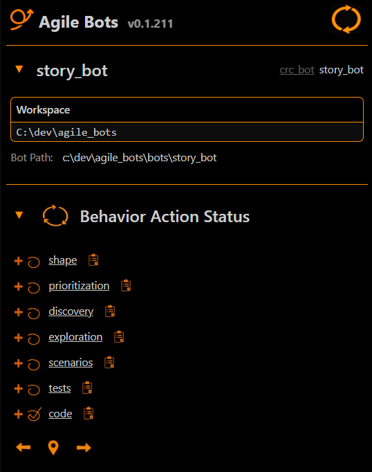  

*Navigate through all 7 StoryBot behaviors with visual progress tracking*

**Best Practices:**
- Progressive refinement from vision to code
- Story mapping and domain modeling
- BDD scenario development
- Vertical slice story decomposition
- Test-driven development workflows
- Acceptance criteria validation

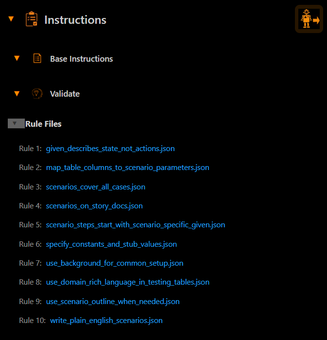  

*Built-in validation rules ensure scenarios follow BDD best practices*

### CRC Bot

Models solution domains using CRC (Class-Responsibility-Collaborator) cards to define clean object-oriented architectures:

- **Domain:** Extract domain concepts and responsibilities from stories, build initial CRC cards
- **Design:** Apply OOP design principles and patterns to refine object responsibilities
- **Walkthrough:** Validate the CRC model by tracing object flows through real scenarios

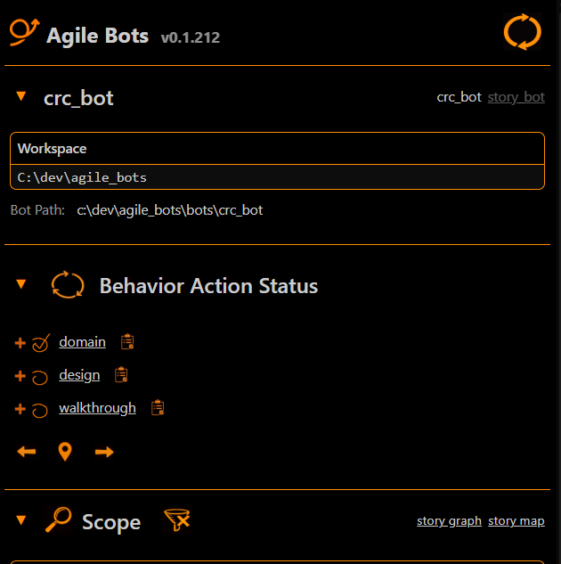  

*Navigate through all 3 CRC Bot behaviors with visual progress tracking*

**Best Practices:**
- Responsibility-driven design
- Object collaboration modeling
- Domain-driven design principles
- OOP pattern application
- Walkthrough-based validation
- Clear separation of concerns

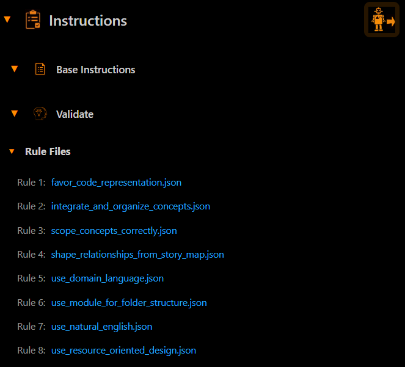  

*Built-in validation rules ensure domain models follow DDD and OOP best practices*

### More Bots Coming Soon

- Domain-Driven Design Bot
- Architecture-Driven Delivery Bot
- Behavior-Driven Development Bot
- Validated Learning Bot
- And much more

## Multiple Interfaces

### Command-Line Interface (CLI)

- Full-featured terminal interface (`story_bot_cli`, `crc_bot_cli`)
- Behavior navigation and action execution
- Scope management to filter work by stories, epics, or increments
- State persistence across sessions
- Multiple output formats: TTY-Terminal, JSON, and Markdown
- JSON output enables programmatic integration and custom tooling

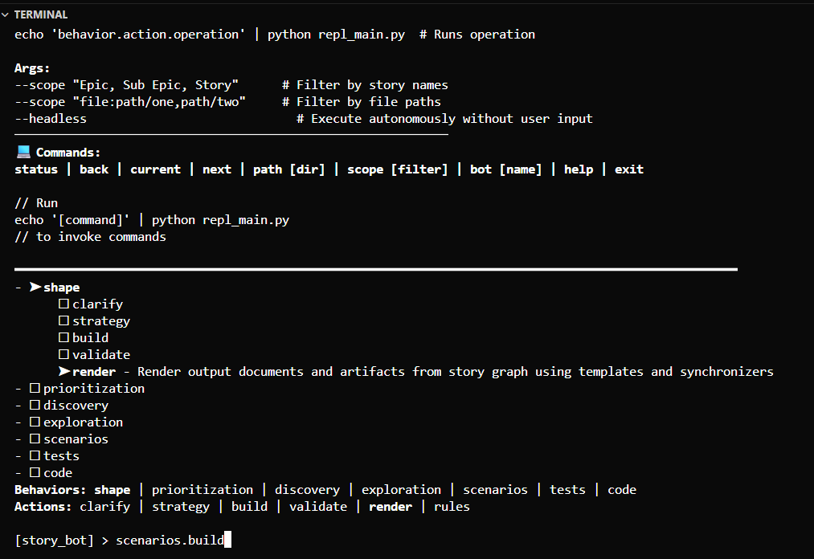  

*Interactive terminal with behavior tree, available commands, and navigation support*

### VSCode Panel Extension

- Visual interface embedded directly in your editor
- Real-time workflow visualization
- Interactive views for behaviors, instructions, and scope
- Click-to-execute actions and navigate workflows
- Live session management with persistent Python backend

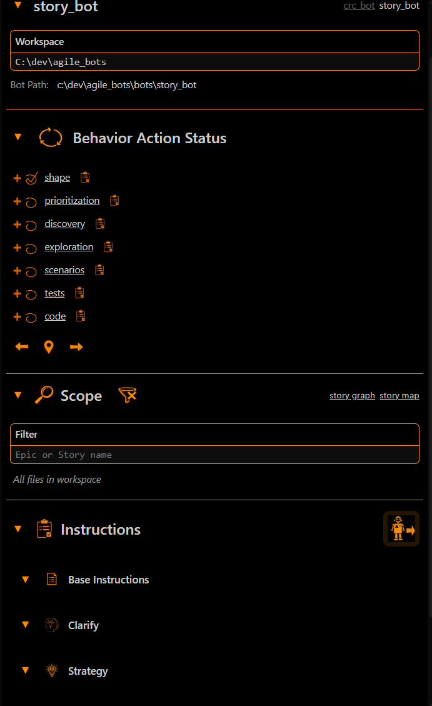

*Full panel view showing workspace, behaviors, scope filtering, and contextual instructions*

### Direct AI Channel

- MCP Server integration for AI assistants (Claude, ChatGPT)
- Natural language invocation via trigger words
- Cursor command/VSCode Chat commands for seamless workflow execution
- Automatic routing to current workflow state

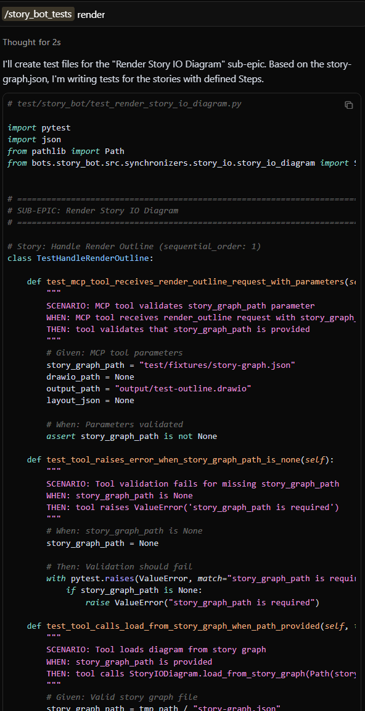  

*AI generates test files following BDD patterns with scenario validation and proper test structure*

## Guided Workflow System

Both bots follow a consistent 5-action pattern for each behavior:

1. **Clarify** - Gather context through structured questions
2. **Strategy** - Select a strategy to apply specific practices
3. **Build** - Construct story graphs, tests, and code
4. **Validate** - Check against built-in rules and scanners
5. **Render** - Generate story maps, acceptance criteria, scenarios, test cases, domain models, and working code

  

*Each behavior expands to show all 5 workflow actions with progress tracking*

### 1. Clarify - Structured Context Gathering

The Clarify action presents targeted questions to ensure the AI has all necessary context:

  

*AI generates answers based on context and configurable questions*

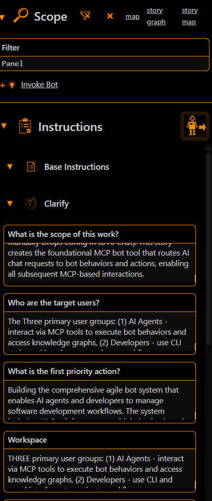  

*Edit, refine, and regenerate clarification responses*

### 2. Strategy - Choose Your Approach

The Strategy action helps you select the right approach based on your gathered context. The AI presents structured strategy questions and displays your previous clarification responses to inform strategic decisions:

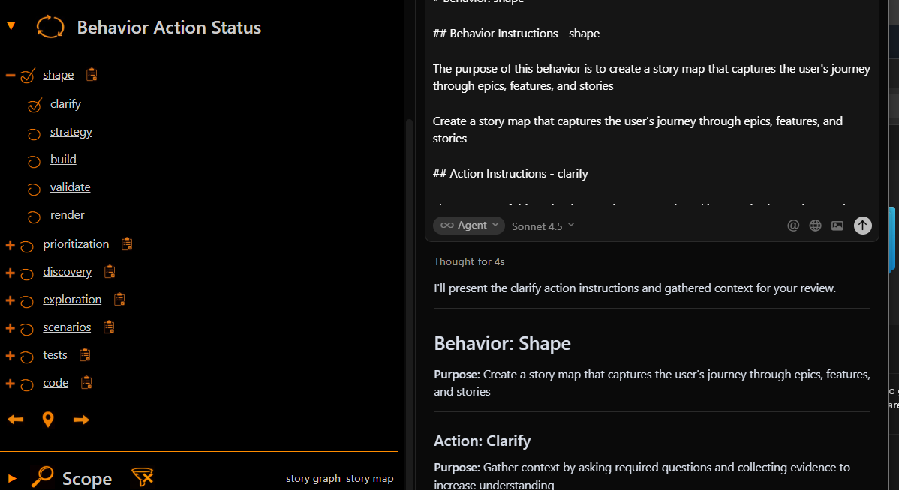  

*AI chooses contextually relevant strategies to guide the depth and approach you want to take to shaping and other behaviors*

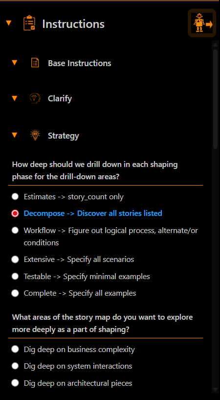  

*Edit and refine strategies based on your preferred approach*

### 3. Build - Generate story graphs, tests, and code

Construct structured representations of your stories, tests, and code.

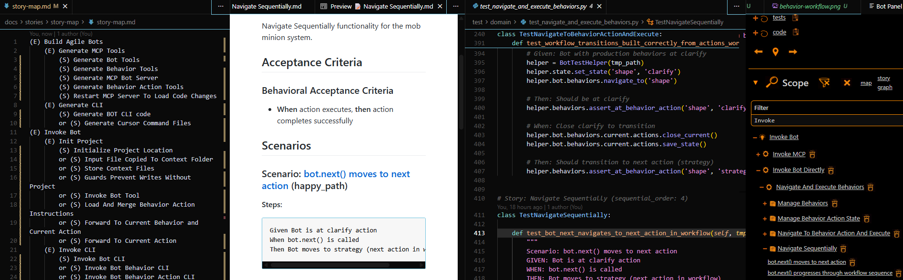  

*Generate story maps, story scenarios, and other artifacts*

### 4. Validate - Automated Quality Checks

Detect violations and correct based on configurable best practices:

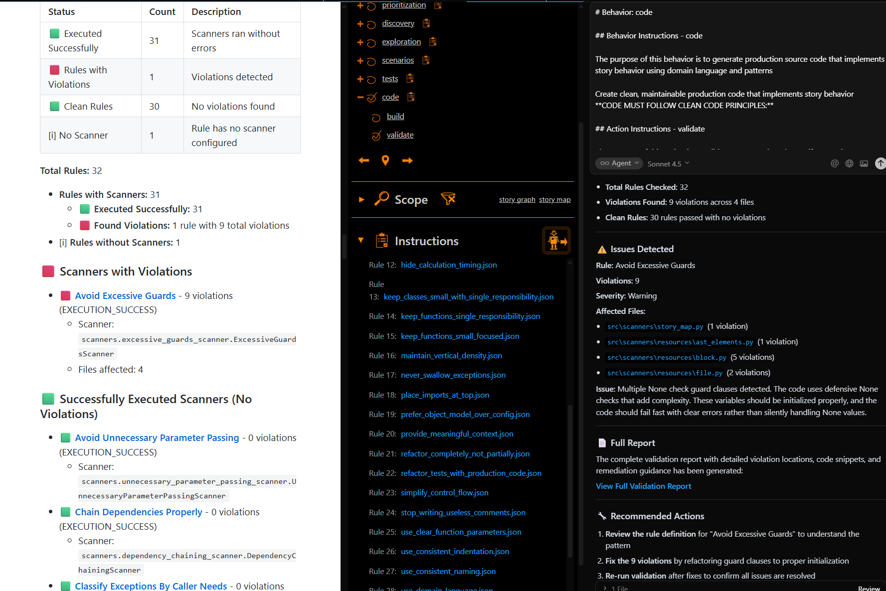  

*Review scanner execution status, violation details by rule, and access detailed reports*

### 5. Render - Generate Deliverables

The Render action transforms knowledge graphs into documentation, diagrams, and reports for your team. It uses templates and synchronizers to generate various outputs including story maps, domain models, test scenarios, and domain model walk-throughs:

  

*Generates artifacts simultaneously in multiple formats including JSON knowledge graphs, Markdown documentation, and visual diagrams*

## AI Instructions Panel

The panel provides rich, contextual instructions to guide your AI assistant through each step, including base behavior instructions, action-specific guidance, structured clarification questions, evidence requirements, knowledge graph templates, rules, and output paths.

## Built-In Intelligence

- **Guardrails:** Structured questions and evidence requirements guide you through each phase and validate AI understanding before proceeding
- **Rules Injection:** Configurable agile best practices guide AI work supported by code scanners/evals
- **Story and Domain Graph:** Structured JSON representations of stories, domains, and tests
- **Templates:** Generate Markdown documents, Mermaid diagrams, Drawio diagrams, and more
- **Activity Tracking:** Complete audit trail of all work performed

## Installation

```bash
# Clone the repository
git clone https://github.com/agilebydesign/agile_bots.git
cd agile_bots

# Install dependencies
pip install -r requirements.txt

# Install in development mode
pip install -e .
```

## Getting Started

```bash
# Start story mapping
story_bot_cli --behavior shape

# Model your domain objects
crc_bot_cli --behavior domain

# Continue from where you left off
story_bot_cli  # or crc_bot_cli

# Get help
story_bot_cli --help
crc_bot_cli --help
```

## What Makes This Different

Rather than hiring Agile by Design, or any other Agile coaches to help train you on Agile methods and approaches, just install this in Visual Studio or Cursor, use ACE to inject Agile instructions into your AI prompting and you'll never have to speak to another Agile coach again.

In all seriousness, if you are tired of fighting with your AI assistant to deliver well-crafted, simple, story-driven, testable code, then give this tool a try.

## Licensing

This project is **dual-licensed**:

### Option 1: AGPL v3 (Free & Open Source)

- ✅ Free to use, modify, and distribute
- ✅ Use commercially
- ⚠️ **Must share modifications** under AGPL v3
- See [LICENSE](LICENSE) for details

### Option 2: Commercial License

- ✅ Keep modifications private
- ✅ No copyleft obligations
- ✅ Legal indemnification
- 💰 Contact [Agile by Design](https://www.agilebydesign.com/) for pricing

[View Commercial License Terms](LICENSE-COMMERCIAL.md)

## Technical Details

- **Language:** Python 3.10+
- **Core Dependencies:** FastMCP, NLTK
- **Outputs:** JSON knowledge graphs, Markdown docs, Mermaid diagrams, validation reports
- **Testing:** Comprehensive test suites for domain logic, CLI, and panel interfaces

## Contributing

Contributions are welcome! Please ensure your code follows the existing patterns and includes appropriate tests.

## Support

For questions, issues, or commercial licensing inquiries, visit [Agile by Design](https://www.agilebydesign.com/).
