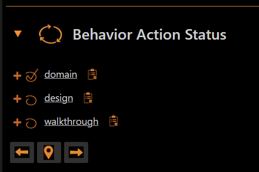
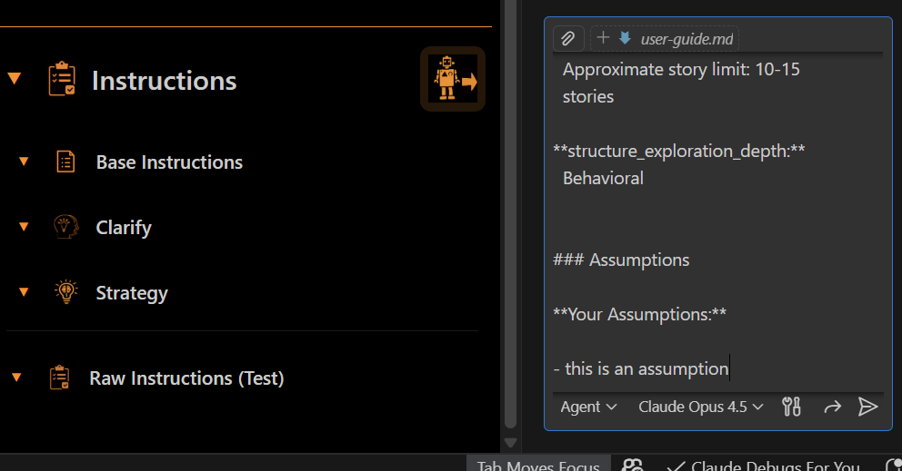
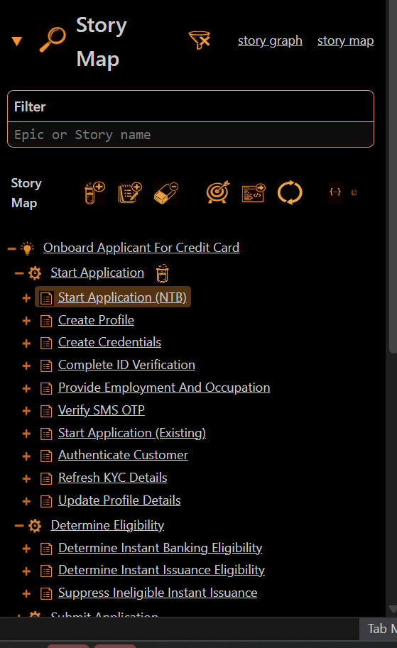
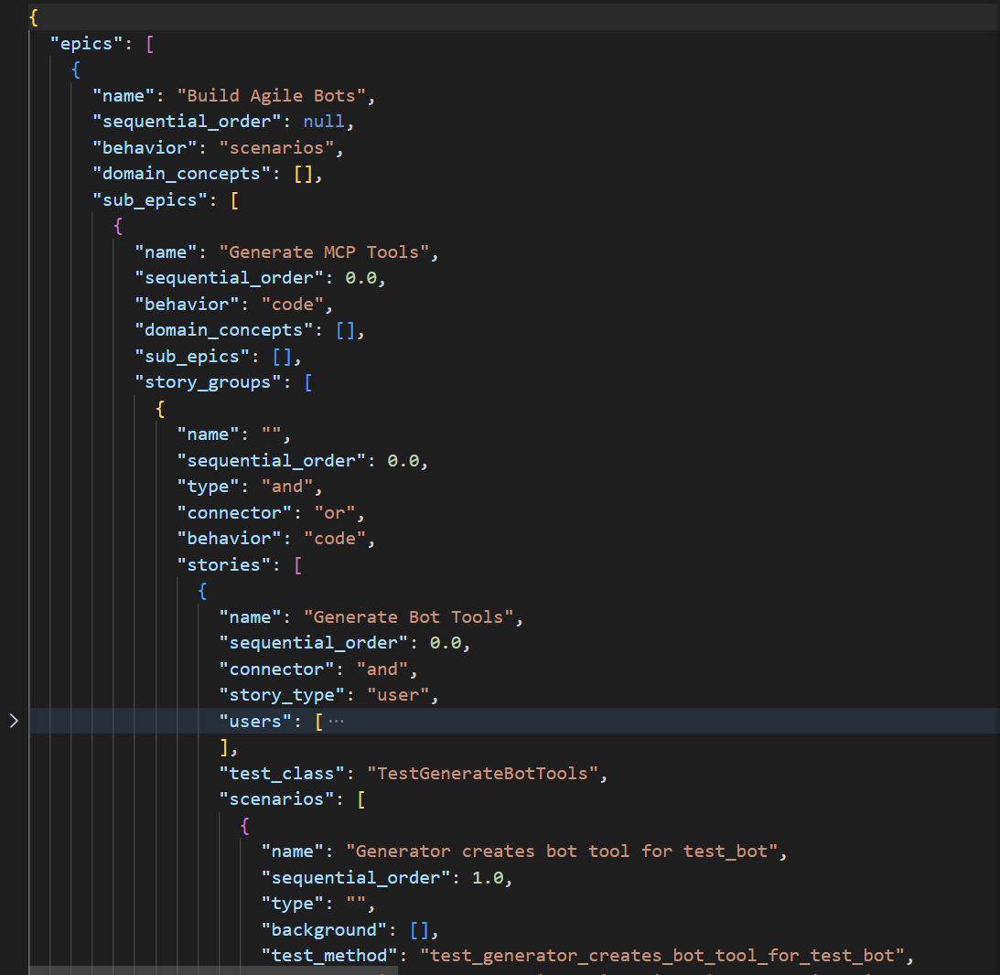

# Agile Bots User Guide

**AI-powered bots that inject Agile delivery, product, and engineering best practices directly into your workflow.**

---

## Table of Contents

1. [Introduction](#1-introduction)
2. [How It Works](#2-how-it-works)
3. [Features](#3-features)
4. [The Bots](#4-the-bots)
5. [Opening the Panel](#5-opening-the-panel)
6. [The Panel Interface](#6-the-panel-interface)
7. [Selecting Your Workspace](#7-selecting-your-workspace)
8. [Navigating Behaviors](#8-navigating-behaviors)
9. [The Behavior Workflow](#9-the-behavior-workflow)
10. [Step 1: Clarify](#10-step-1-clarify)
11. [Step 2: Strategy](#11-step-2-strategy)
12. [Step 3: Build](#12-step-3-build)
13. [Step 4: Validate](#13-step-4-validate)
14. [Step 5: Render](#14-step-5-render)
15. [Shape Behavior: Story Map Increments](#15-shape-behavior-story-map-increments)
16. [Exploration Behavior: Scenario Details](#16-exploration-behavior-scenario-details)
17. [Scenarios Behavior: BDD Specification](#17-scenarios-behavior-bdd-specification)
18. [CRC Domain Behavior: Model Outline](#18-crc-domain-behavior-model-outline)
19. [CRC Walkthrough Behavior: Realizations](#19-crc-walkthrough-behavior-realizations)
20. [Tests Behavior: Test Generation](#20-tests-behavior-test-generation)
21. [AI Code and Test Generation](#21-ai-code-and-test-generation)
22. [The Story Graph](#22-the-story-graph)
23. [Using the CLI](#23-using-the-cli)

---

## 1. Introduction

Agile Bots enables **Agile-AI Augmented Delivery** through a VS Code/Cursor plugin that steers your AI agent through agile workflows. It injects prompts with context, strategies, and best practices while generating and synchronizing common agile artifacts (stories, tests, code) and preventing the most common AI mistakes.

Integrating agile practices with AI-assisted delivery can have a dramatic impact on pace, quality, cost, and outcomes. Rather than fighting with your AI assistant to deliver well-crafted, simple, story-driven, testable code, Agile Bots guides the AI through proven workflows that produce quality results.

> *We use the term "Agile practices" to mean the pragmatic application of Kanban, story mapping, BDD scenarios, test-driven development, domain-driven design, clean code principles, and CI/CD/DevOps.*

---

## 2. How It Works

Agile Bots works by injecting **context**, **previous work**, and **rules** into every AI prompt based on proven agile practices.

### The Core Mechanism

1. **Context Injection** — At each step, the bot injects relevant context into your AI prompts: clarification answers, strategy decisions, knowledge graph content, and instructions specific to the current action.

2. **Layered Knowledge & The Knowledge Graph** — The **knowledge graph** (`story-graph.json`) is the central artifact—a structured representation of stories, domain concepts, acceptance criteria, and relationships that is continually refined as you progress through behaviors. Clarification answers and strategy decisions are preserved and injected at each step.

3. **Rules & Validation** — Configurable best practice rules guide AI work. Automated scanners check output against these rules and report violations before they become problems.

4. **Progressive Workflow** — Rather than trying to do everything at once, the bot guides humans and AI through a step-by-step workflow: Clarify → Strategy → Build → Validate → Render. Each step builds on the previous.

5. **Synchronized Artifacts** — The knowledge graph serves as the central knowledge hub connecting stories, tests, and code. Changes in one place update everywhere automatically through synchronizers.

### Configurable Behavior-Action-Practice Bots

Each bot is organized into **behaviors** (major workflow phases) and **actions** (steps within each behavior). Every action is backed by configurable **practices**:

- **Behaviors** define the major phases of work (e.g., Shape, Discovery, Design)
- **Actions** define the steps within each behavior (Clarify, Strategy, Build, Validate, Render)
- **Practices** are the rules, templates, and guardrails that guide AI work

---

## 3. Features

| Feature | Description |
|---------|-------------|
| **Agile Flows** | Configurable workflows that help you complete your highest priority increment fast |
| **Prompt Scoping** | Directs AI to work on a small number of stories/epics/increments at a time |
| **Prompt Injection** | Practices, context, and strategies are injected during every build |
| **Human-In-The-Loop Cycle** | Clarify → Strategy → Build → Render → Validate cycle minimizes hallucination |
| **Layered Context Injection** | Answers, strategies, and context are preserved and injected at each step |
| **Synchronizer Architecture** | Updates diagrams, markdown, and code when the knowledge graph changes |
| **Knowledge Graph** | Connects all story-related knowledge and code for context injection |
| **Audit Trails** | Logs every answer, decision, and evidence provided |
| **Practice-as-Code Validation** | Scanners guide AI to confirm, report, and fix errors |
| **Guardrails** | Structured questions and evidence requirements guide each phase |
| **Rules Injection** | Configurable agile best practices supported by code scanners |
| **Templates** | Generate Markdown, Mermaid diagrams, DrawIO diagrams, and more |

---

## 4. The Bots

This release includes **StoryBot** and **CRC Bot**.

### StoryBot

Structure user needs into testable, incremental stories through a 7-behavior workflow:

| Behavior | Purpose |
|----------|---------|
| **Shape** | Create story maps and domain models from user context |
| **Prioritization** | Organize stories into increments and prioritize backlogs |
| **Discovery** | Elaborate stories with flows, rules, and integration details |
| **Exploration** | Define acceptance criteria with Given/When/Then statements |
| **Scenarios** | Write detailed BDD scenarios from acceptance criteria |
| **Tests** | Generate executable test code from scenarios |
| **Code** | Write SOLID-level code quality |

### CRC Bot

Models solution domains using CRC (Class-Responsibility-Collaborator) cards:

| Behavior | Purpose |
|----------|---------|
| **Domain** | Extract domain concepts and responsibilities from stories |
| **Design** | Apply OOP design principles and patterns |
| **Walkthrough** | Battle test the CRC model by tracing object flows through one or more scenarios |

---

## 5. Opening the Panel

To open the Agile Bots panel in VS Code:

1. Open the **Command Palette** (`Ctrl+Shift+P` / `Cmd+Shift+P`)
2. Type **"Agile Bots"**
3. Select **"Agile Bots: Open Panel"**

Or click the **Agile Bots icon** in the Activity Bar on the left side of VS Code.


The panel opens as a sidebar showing the full Agile Bots interface.

---

## 6. The Panel Interface

The panel is organized into several sections:


| Section | Description |
|---------|-------------|
| **Bot Header** | Shows the current bot (story_bot or crc_bot), version, and refresh button |
| **Workspace** | The path to your project directory where artifacts are created |
| **Bot Path** | The path to the bot configuration files |
| **Behavior Action Status** | Expandable section showing workflow progress |
| **Story Map** | Links to knowledge graph and story map files, plus scope filtering |
| **Filter** | Enter Epic or Story names to scope your work |
| **Instructions** | Contextual guidance for the current behavior and action |
| **Build with Agent** | Generate agent instructions for AI assistants |

---

## 7. Selecting Your Workspace

The **Workspace** field shows your current project directory. This is where all artifacts will be created.


### Setting Up Your Workspace

1. Create a project folder with your context files
2. Add a `context/` folder with requirements, interviews, or specifications
3. Open that folder in VS Code
4. The panel will detect it as your workspace


---

## 8. Navigating Behaviors

Click **Behavior Action Status** to expand the behavior tree.


For StoryBot, you'll see all seven behaviors: Shape, Prioritization, Discovery, Exploration, Scenarios, Tests, Code.



For CRC Bot, you'll see three behaviors: Domain, Design, Walkthrough.

### Expanding a Behavior

Click on any behavior to see its actions:

Most behaviors follows the same 5-action pattern:  
(some behaviors have less actions)
```
Clarify → Strategy → Build → Validate → Render
```

| Action | Purpose |
|--------|---------|
| **Clarify** | Gather context through structured questions |
| **Strategy** | Choose approach based on context |
| **Build** | Construct the knowledge graph, tests, or code |
| **Validate** | Check against best practice rules |
| **Render** | Generate documentation and diagrams |

## 10. The Action Cycle

For each action:
1. **Navigate** to the behavior, then click the action
2. **Submit** — Click the Submit button to send instructions to the AI chat
3. **Review** — Examine the AI-generated output, then press enter to submit
4. **Next** — Move to the next action

For the conservative complete each action before moving to the next, for the impatient, or brave click build and move on to the next behavior 

---
## A Note on Working with Instructions

The Instructions section provides contextual guidance for each action.

### Instructions Panel


When you navigate to a behavior/action, the Instructions section shows:
- What this action accomplishes
- Questions to answer or decisions to make
- Templates and output formats
- Rules that will be applied

### Detailed Instructions

Click to expand for full instruction details:


Click the **Submit** button to send these instructions directly to your AI chat. The bot automatically injects context, strategies, and rules into the prompt.

#### Sources of Instructions

When you submit, the bot assembles instructions from multiple sources:

| Source | Description |
|--------|-------------|
| **Behavior** | Base instructions for the current behavior (Shape, Discovery, etc.) |
| **Action** | Specific instructions for the action (Clarify, Strategy, Build, Validate, Render) |
| **Guardrails** | AI constraints that prevent common mistakes |
| **Scope** | The current filter—limits work to selected epics/stories |
| **Previous Work** | Clarification answers, strategy decisions from earlier steps |

Each action also has **optional action-specific sections** that add specialized content:

- **Clarify** — Structured questions to answer
- **Strategy** — Decision options and tradeoffs
- **Build** — Templates and content examples
- **Validate** — Rules and scanner definitions
- **Render** — Output templates and synchronizers





### Step 1: Clarify

The Clarify action gathers context through be being asked to answer a set of configurable questins unique to the behavior. This allows you to confirm that the AI understands. This allows you to confirm that the AI understands Before going too far down the rabbit hole of generating content.

#### Starting Clarify

1. Navigate to the behavior and click on the **Clarify** action
2. Review the questions shown in the Instructions panel
3. Click the **Submit** button
4. Add context files or folders to the AI chat box. Press enter, to submit.


#### AI Response

The AI assistant answers the clarification questions based on your context files.


#### Review and Edit

Review the AI-generated answers in the chat. Edit, refine, and submit to AI chat again, as needed.


Your answers are saved to `clarification.json` and injected into subsequent steps.

#### Clarify Instructions Content

The Clarify action injects **structured questions** specific to each behavior. For example, Shape.Clarify asks about business goals, user types, and existing systems. The questions guide the AI to extract the right context from your files.

---

### Step 2: Strategy

The Strategy action helps you choose your approach based on the context you've gathered.

#### Starting Strategy

1. Navigate to the behavior and click on the **Strategy** action
2. Review the strategy options in the Instructions panel
3. Click the **Submit** button to send the instructions to your AI chat

#### Making Selections

Review the AI output and choose strategies that match your goals and situation.


#### Strategy Analysis

The AI analyzes your selections and provides recommendations.


Your decisions are saved to `strategy.json` and guide the Build action.

#### Strategy Instructions Content

The Strategy action injects **decision options and tradeoffs** for the current behavior. The AI presents choices (e.g., "incremental vs. big-bang", "breadth-first vs. depth-first") and you select what fits your situation.

---

### Step 3: Build

The Build action constructs the knowledge graph, tests, or code based on your context and strategy.

#### Starting Build

1. Navigate to the behavior and click on the **Build** action
2. Review the build instructions in the Instructions panel
3. Click the **Submit** button to send the instructions to your AI chat
4. Wait (grab some coffee if this pass is your first over a particularly large amount of context)
5. Review the generated story graph, or  proceed to **render** if you like reading english better than json 😊
6. Make edits, and/or resubmit until happy

#### Building the Story Map

In the Shape behavior, build creates the initial outline of your story map structure. This outline is saved to the **story graph** (`story-graph.json`)

The story graph can then be **rendered** into readable forms—markdown documents, Mermaid diagrams, and detailed story files.

#### The Story UI
TAfter shaping the story graph will also appear in the Agile Bot Panel. The panel has a section dedicated to working with story graph data where you can :
- **Navigate**  explore, filter, and select, and open files for epics, stories, acceptance criteria, scenarios and test code
- **Edit** rename, move, delete, create story graph nodes (epics, stories, etc) in place
- **Submit** Submit a node directly to AI chat for refinement 

(see [Section 17: The Story Graph](#17-the-story-graph for more details))



#### Build Instructions Content

The Build action injects **templates and content examples** from the behavior's `content/` folder. These show the AI what good output looks like—story map structures, scenario formats, test patterns, code conventions.

---

### Step 4: Validate

The Validate action runs bot AI and code scripted scanners that check work against best practice rules.

#### Starting Validate

1. Navigate to the behavior and click on the **Validate** action
2. Click the **Submit** button to send the validation instructions to your AI chat
3. Review the generated report for any violations or issues
4. instruct the AI on what fixes to make

#### Validation Report

After validation runs, you see a summary of violations:


Violations are categorized by severity:
- **Error** — Must fix before proceeding
- **Warning** — Should fix for quality
- **Info** — Suggestions for improvement

#### How Rules and Scanners Work

Validation uses two components working together:

1. **Rules** — Configurable best practice definitions (e.g., "Stories must be vertical slices", "Classes should have single responsibility")
2. **Scanners** — Code that checks your work against the rules and reports violations

**The Validation Flow:**
```
Scanners run → AI assesses rules → Fixes suggested → Report generated
```

1. **Scanners run** against your story graph or code, checking for violations
2. **AI performs a second check**, directly assessing the rules against the work
3. **AI suggests fixes** for any violations found from both passess
4. **Report is generated** summarizing all violations and recommended fixes

#### Viewing and Editing Rules

Rules are stored in the bot configuration and can be customized:

1. **View rules** — Open the bot's `action_config.json` files in the `base_actions/validate/` folder
2. **Edit rules** — Modify rule definitions to match your team's practices
3. **Add new rules** — Create custom rules for domain-specific validations

Each rule defines:
- **Name** — What the rule checks
- **Severity** — Error, Warning, or Info
- **Description** — Why this rule matters
- **Scanner** — An associated scanner that can use code to detect violations

#### Example Rules

**StoryBot Rules:**


| Rule | Behavior | Purpose |
|------|----------|---------|
| Vertical Slices | Shape | Stories deliver end-to-end value |
| Prioritized Increments | Prioritization | Stories grouped by business value |
| Complete Flows | Discovery | Story details include all integration points |
| Given/When/Then | Exploration | Acceptance criteria are testable |
| Independent Scenarios | Scenarios | Scenarios don't depend on each other |
| Test Coverage | Tests | All acceptance criteria have tests |
| SOLID Principles | Code | Code follows clean architecture |

**CRC Bot Rules:**


| Rule | Behavior | Purpose |
|------|----------|---------|
| Single Responsibility | Domain | Each class has one reason to change |
| Clear Collaborators | Design | Relationships are well-defined |
| Scenario Coverage | Walkthrough | All scenarios trace through the model |

#### Validate Instructions Content

The Validate action injects **rules and scanner definitions** from the behavior's `rules/` folder. Each rule specifies what to check, the severity level, and optionally a code scanner that can detect violations automatically.

---

### Step 5: Render

The Render action transforms the knowledge graph into readable documentation and diagrams.

#### Starting Render

1. Navigate to the behavior and click on the **Render** action
2. Click the **Submit** button to send the render instructions to your AI chat
3. Review the AI output and confirm the generated documentation


Rendered files are saved to your `docs/` folder and stay synchronized with the knowledge graph.

#### Render Instructions Content

The Render action injects **output templates and synchronizer definitions**. Templates define the format for markdown docs, Mermaid diagrams, and DrawIO files. Synchronizers keep rendered files in sync when the story graph changes.

---

## 15. Prioritize : Story Map Increments

The Prioritize behavior takes your initial story map structure, and organizes stories into prioritized increments.


---

## 16. Exploration Behavior: Scenario Details

The Exploration behavior expands each story into detailed scenarios. Click on any story or activity to see the underlying user actions and system behaviors.


---

## 17. Scenarios Behavior: BDD Specification

The Scenarios behavior produces detailed Given/When/Then specifications with example data tables.


---

## 18. CRC Bot: Domain Modeling

At this point—or even a little earlier—it's a good idea to switch to the **CRC Bot** and model your business domain. CRC (Class-Responsibility-Collaborator) cards help you identify domain concepts, define their responsibilities, and map how they collaborate.

The Domain behavior extracts concepts from your stories and organizes them into modules like adjudication, eligibility, fulfillment, and onboarding. Each concept lists what it does and which other concepts it works with.


---

## 19. CRC Walkthrough Realizations

The Walkthrough behavior traces object interactions through scenarios, validating that your CRC model can handle real user flows.

 Users typically select a couple of stories or a sub-epic. and the AI identifies one or more scenarios where we "walk" the domain model identifying messaging and interactions, along with what's passed and what's returned at each step.


---

## 20. Test: Test Generation

The Tests behavior transforms BDD scenarios into executable pytest code that validates your acceptance criteria.


The AI follows BDD patterns and scenario validation to produce proper test structure.


---

## 21. Code: Test-Driven Implementation

The Code behavior generates implementation code that is **driven entirely by your tests**. This is true test-driven development—every line of code exists to make a test pass.

### Tests Drive the Design

Your BDD scenarios and pytest files define *what* the code must do. The AI reads the test assertions, understands the expected behaviors, and writes code that satisfies them. Test completeness determines code completeness: if a behavior isn't tested, it won't be implemented. If a test fails, the code isn't done.

This approach prevents:
- Over-engineering features that aren't needed
- Missing edge cases that tests would have caught
- Drift between what code does and what users expect

### Code Quality Scanners

The Code behavior runs a significant battery of **code quality scanners** before declaring victory:

**SOLID Engineering Scanners:**
- Single Responsibility — Classes do one thing
- Open/Closed — Extensible without modification
- Liskov Substitution — Subtypes are substitutable
- Interface Segregation — No forced dependencies
- Dependency Inversion — Depend on abstractions

**AI Guardrail Scanners:**
- No hallucinated imports or libraries
- No invented APIs that don't exist
- No placeholder "TODO" implementations
- No copy-paste duplication
- No magic numbers or hardcoded values
- Consistent naming conventions
- Proper error handling

These scanners catch the common mistakes AI makes when generating code—the "don't do dumb shit" rules that keep generated code production-ready.


---

## 22. The Story Graph  UI

The **Story Graph** is the central knowledge artifact that connects all your work.



### Navigating the Story Graph

The Story Map panel displays the story graph as a navigable tree:

- **Epics** — Top-level goals (gear icon)
- **Stories** — User stories within each epic (document icon)
- **Acceptance Criteria** — Given/When/Then statements for each story

Click on any element to expand it and see its children.


### Editing and Submitting

You can interact directly with story graph elements:

1. **Click on an epic or story** to select it
2. **Use the action icons** in the toolbar to add, edit, or rename elements

### Two Ways to Submit

There are two submit options for selected story graph nodes:

**Submit for Current Behavior and Action:**
Submit the selected node to AI chat using whatever behavior and action is currently selected in the panel. Use this when you want to refine, elaborate, or fix something within the step you're already working on.

**Submit Based on Node Completeness:**
Submit the selected node and let the bot automatically determine which behavior to run the build action on; The behavior selected is based on how complete the node is. The bot inspects what's missing and picks the right next step:

| Node State | Auto-Selected Behavior |
|------------|----------------------|
| Story with no acceptance criteria | Exploration (to add loosely structured When/Then criteria) |
| Story with criteria but no scenarios | Scenarios (to add full Given/When/Then with examples, backgrounds, and outlines) |
| Story with scenarios but no tests | Tests (to generate pytest code) |
| Story with tests but no code | Code (to implement) |

This lets you work node-by-node: select a story, submit it, and the bot figures out what it needs next.

The story graph is saved to `story-graph.json` and serves as the single source of truth for your project.

### Story Graph Refinement

The story graph evolves as you progress through behaviors:

| Behavior | Adds to Story Graph |
|----------|--------------------|
| Shape | Epics, stories, initial structure |
| Discovery | Flows, rules, integration details |
| Exploration | Acceptance criteria (loosely structured When/Then) |
| Scenarios | BDD scenarios (full Given/When/Then with examples, backgrounds, outlines) |
| Tests | Test file references |
| Code | Code file references |

Each behavior enriches the graph, and Render transforms it into readable documentation.

---

## 23. Using the CLI

Agile Bots includes a **Command Line Interface** that provides the same functionality as the VS Code panel. The CLI is useful when:

- **AI agents need direct access** — An AI chatbot or backend agent can invoke bot commands without a UI
- **Scripting and automation** — Chain bot commands in shell scripts or CI/CD pipelines
- **Integration with other tools** — Pipe bot output to other command-line tools
- **Headless environments** — Run on servers or containers without VS Code

### Starting the CLI

Launch the CLI from your terminal:

```powershell
c:\dev\agile_bots\bots\story_bot\story_cli.ps1
```

You'll see the available behaviors and actions:


The CLI shows the same behavior hierarchy as the panel: shape, prioritization, discovery, exploration, scenarios, tests, and code—each with their actions (clarify, strategy, build, validate, render).

### Setting Your Workspace

Just like selecting a workspace in the panel, use the `path` command to set your working directory:

```
[story_bot] > path C:\dev\onboarding_credit
```


This tells the bot where to find your context files and where to save artifacts like `story-graph.json`.

### Submitting Instructions

The `submit` command works like clicking the Submit button in the panel. It copies the assembled instructions to your clipboard, ready to paste into an AI chat:

```
[story_bot] > submit shape.clarify
[OK] Instructions copied to clipboard!
  Behavior: shape
  Action: clarify
  Length: 645539 characters
```


### Scoping Your Work

The `scope` command filters the story graph, just like the Filter field in the panel:

```
[story_bot] > scope Intercept
Status: success
Scope set to story: Intercept
```


The CLI displays the filtered story graph tree, showing only epics and stories matching your scope.

### Getting Help

The `help` command shows all available commands:


**Core Commands:**

| Command | Purpose |
|---------|---------|
| `path [dir]` | Set working directory (like Workspace in panel) |
| `scope [filter]` | Filter story graph (like Filter in panel) |
| `submit behavior.action` | Copy instructions to clipboard (like Submit button) |
| `status` | Show full workflow hierarchy |
| `next` / `back` | Navigate to next/previous action |
| `current` | Re-execute current operation |

**Navigation Examples:**

```
echo 'shape' | python repl_main.py          # Jump to behavior
echo 'shape.build' | python repl_main.py    # Jump to behavior.action
echo 'submit shape.clarify' | python repl_main.py  # Submit specific action
```

The CLI provides full parity with the panel—everything you can do in the UI, you can do from the command line.

---

*For questions or commercial licensing, visit [Agile by Design](https://www.agilebydesign.com/).*


## Quick Reference

### Workflow Order

**StoryBot:** Shape → Prioritization → Discovery → Exploration → Scenarios → Tests → Code

**CRC Bot:** Domain → Design → Walkthrough

### Action Order

Clarify → Strategy → Build → Validate → Render

### Key Files

#### Workspace Files

These files are created in your project workspace as you work:

| File | Purpose |
|------|---------|
| `story-graph.json` | Main knowledge graph—the single source of truth |
| `clarification.json` | Saved answers from Clarify actions |
| `strategy.json` | Saved decisions from Strategy actions |
| `scope.json` | Current filter/scope selection |
| `docs/stories/` | Rendered story documentation |
| `docs/crc/` | Rendered CRC model documentation |

#### Bot Configuration Files

Bots are configured in `agile_bots/bots/`. Here's the structure using `story_bot` as an example:

```
bots/story_bot/
  bot_config.json          # Bot-level settings
  behaviors/
    shape/                  # One folder per behavior
      behavior.json         # Behavior metadata
      instructions.json     # Prompts for each action
      rules/                # Validation rules
      guardrails/           # AI guardrails
      content/              # Templates and examples
    prioritization/
    discovery/
    exploration/
    scenarios/
    tests/
    code/
```

**Example: The Shape Behavior**

The `shape/` folder configures how the Shape behavior works:

- **behavior.json** — Defines the behavior name, description, and available actions
- **instructions.json** — Contains the prompts injected into AI chat for Clarify, Strategy, Build, Validate, and Render
- **rules/** — Validation rules like "stories must be vertical slices"
- **guardrails/** — AI constraints like "don't invent requirements"
- **content/** — Templates for story maps, domain models, etc.

You can customize any of these files to match your team's practices.

---
