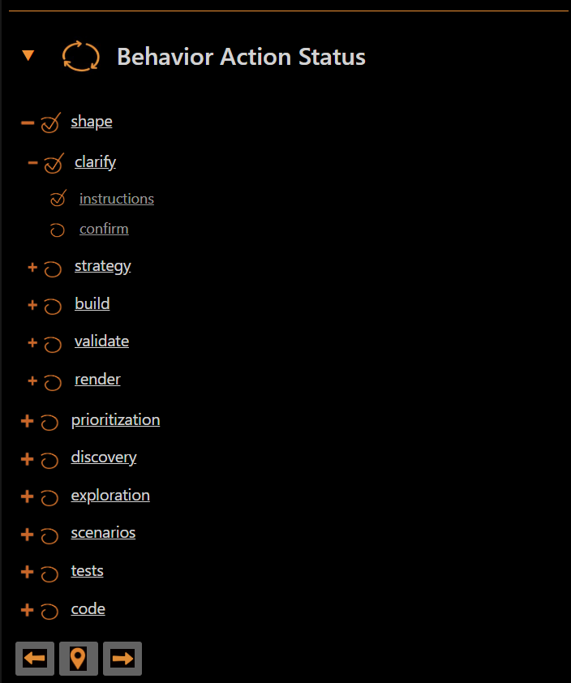

# Invoke Bot Panel Screens

Invoke Bot

Invoke Bot Through Panel

Manage Panel Session

Open Panel

Display Session Status

Change Workspace Path

Switch Bot

Toggle Panel Section

Navigate And Execute Behaviors Through Panel

Display Hierarchy

Navigate Behavior Action

Execute Behavior Action

Manage Scope Through Panel

Filter Story Scope

Display Story Scope Hierarchy

Filter File Scope

Open Story Files

Display Action Instructions Through Panel

Display Base Instructions

Display Clarify Instructions

Display Strategy Instructions

Display Build Instructions

Display Validate Instructions

Display Render Instructions

Display Instructions In Raw Format

Submit Instructions To AI Agent
